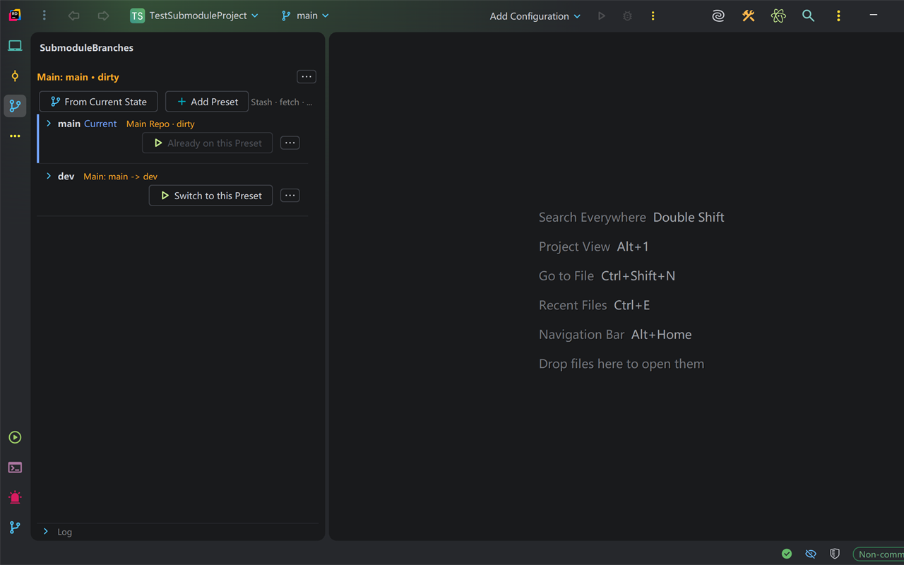
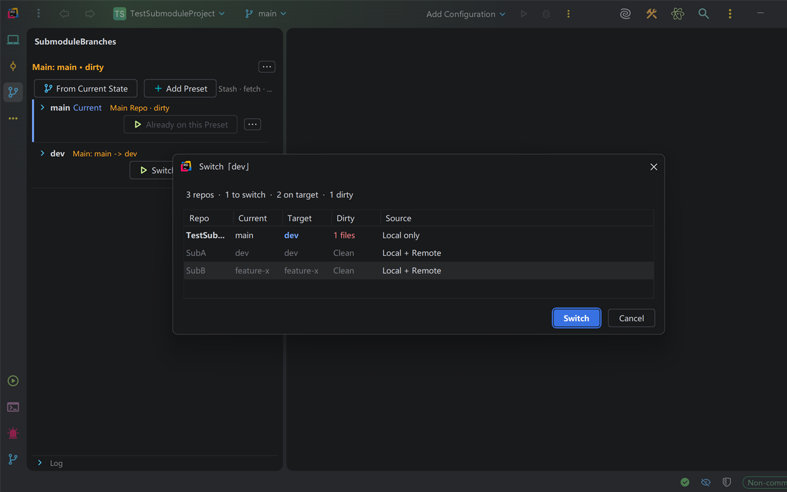
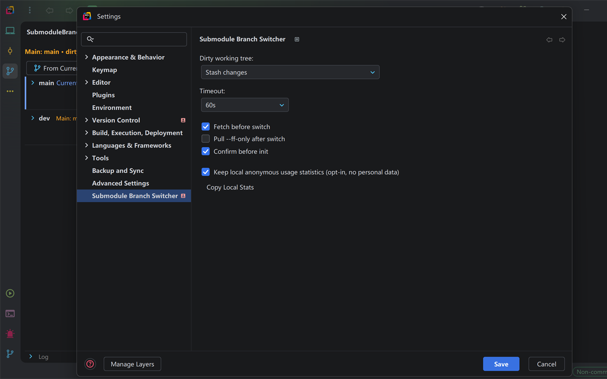

# Submodule Branch Switcher

**JetBrains IDE plugin** - one-click switch the main repo and all submodules to a preset branch combination.


## Supported IDEs

The plugin targets the IntelliJ Platform and depends only on the platform module plus the bundled `Git4Idea` plugin.

Default development SDK:

- IntelliJ IDEA Community 2026.1 (`platform.type=IC`)

Recommended compatibility checks before release:

- IntelliJ IDEA Community (`IC`)
- Rider (`RD`)
- Add PyCharm/WebStorm/CLion verifier codes only when you plan to publish support for them.

Current support matrix:

| IDE family | Status | Notes |
| --- | --- | --- |
| IntelliJ IDEA Community | Primary build target | Default SDK for local development and CI-compatible builds. |
| Rider | Compatibility target | Covered by `plugin.verifier.ideCodes=RD`; keep manual smoke checks before release. |
| IntelliJ IDEA Ultimate | Expected compatible | Same platform + Git APIs, but not listed as a primary verifier target yet. |
| PyCharm / WebStorm / CLion | Not claimed yet | Add verifier codes and manual smoke checks before Marketplace support is advertised. |

## Features

- **Preset management**: save branch combinations (main + submodules) as named presets and switch between them in one click.
- **Preflight preview**: dry-run table showing current to target branch, dirty file count, and branch source per repo.
- **Dirty tree strategies**: stash / skip / force for repos with uncommitted changes.
- **Auto stash pop**: when switching back to the original branch, stashed changes can be restored automatically.
- **Derive feature branches**: create `feature/xxx` on main + all submodules simultaneously from a preset.
- **Rollback**: failed switches record a checkpoint for one-click rollback.
- **Keyboard shortcut**: `Ctrl+Alt+B` opens the preset picker.
- **i18n**: English + Chinese, following the IDE language setting.

## Install

From disk:

1. Build or download `submodule-branch-switcher-{version}.zip`.
2. Open `Settings | Plugins | Install Plugin from Disk...`.
3. Select the `.zip` file.
4. Restart the IDE.

Marketplace publication is planned later.

## Quick Start

1. Open the **SubmoduleBranches** tool window.
2. Click **From Current State** to snapshot current main repo and submodule branches.
3. Click **Switch** on any preset and confirm the preview dialog.

Presets are stored as JSON in `.idea/branch-presets.json` and can be shared through git.

```json
{
  "presets": [
    {
      "name": "dev",
      "main": "develop",
      "submodules": {
        "lib/common": "develop",
        "lib/net": "develop"
      }
    }
  ]
}
```

## Options

Configured via `Settings | Version Control | Submodule Branch Switcher`:

| Option | Default | Description |
| --- | --- | --- |
| Dirty working tree | Stash | Strategy for uncommitted changes: Stash / Skip / Force |
| Timeout | 60s | Max time per `git` command |
| Fetch before switch | On | `git fetch --prune` before checkout |
| Pull after switch | On | `git pull --ff-only` after checkout |
| Confirm before init | Off | Ask before `git submodule update --init` for missing dirs |

## Development

```bash
# Enable local hooks once after clone
git config core.hooksPath .githooks

# Fast structural checks
./gradlew quickCheck

# Core pure JVM tests
./gradlew pureTest

# Platform/integration tests
./gradlew test

# Build plugin zip
./gradlew buildPlugin
# -> build/distributions/submodule-branch-switcher-{version}.zip

# Launch sandbox IDE with the plugin installed
./gradlew runIde
```

Default platform configuration lives in `gradle.properties`:

```properties
platform.type=IC
platform.version=2026.1.3
platform.localPath=
plugin.verifier.ideCodes=RD
plugin.sinceBuild=261
plugin.untilBuild=261.*
```

To test with another local JetBrains IDE, set `platform.localPath` to that IDE installation.

To verify more products before release, extend `plugin.verifier.ideCodes`, for example:

```properties
plugin.verifier.ideCodes=RD,PY,WS,CL
```

## Heavy Diagnostics

```bash
# Large-repo wall-clock benchmark (manual, heavy)
./gradlew benchmark

# Scoped mutation testing (manual, heavy)
./gradlew pitestCore
```

`benchmark` and `pitestCore` are intentionally not part of normal `test` or `releaseCheck`.

## Screenshots

JetBrains Marketplace screenshots (1280x800, 16:10, no device borders):






