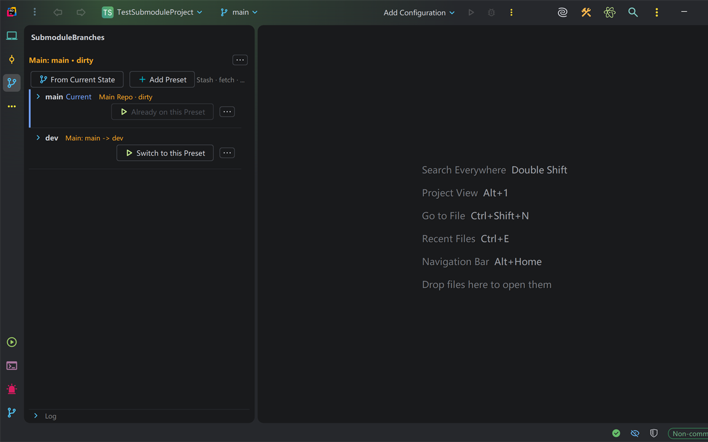
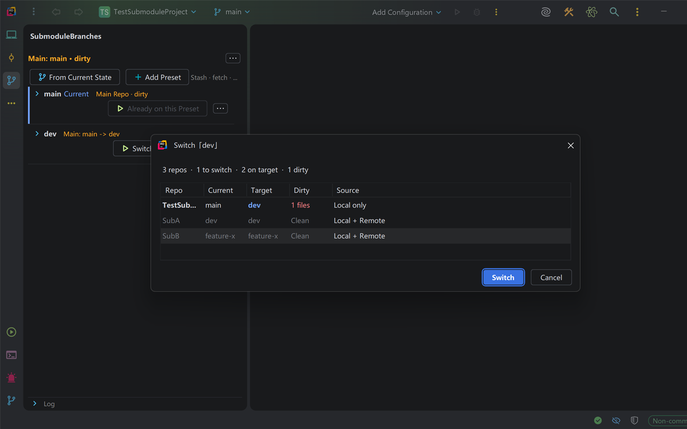
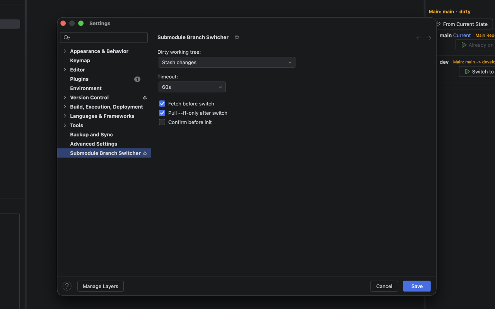

# Submodule Branch Switcher

[English](README.md) | [中文](README.zh-CN.md)

**JetBrains IDE plugin for switching a main repository and all submodules to a saved branch preset in one click.**


Submodule Branch Switcher is built for teams that keep several related repositories in one Git project and need to move them between known branch combinations — `main`, `develop`, release branches, or feature branches.

Presets are project-local JSON. A personal collection defaults to `.idea/branch-presets.json`; a team can commit a project-root `.branch-presets.json` to share one collection. See [Preset files](#preset-files) for how the active file is resolved.

## Contents

- [Highlights](#highlights)
- [Screenshots](#screenshots)
- [Supported IDEs](#supported-ides)
- [Install](#install)
- [Quick Start](#quick-start)
- [Preset files](#preset-files)
- [Options](#options)
- [Collision handling](#collision-handling)
- [Diagnostics](#diagnostics)
- [License](#license)
- [Contributing](#contributing)

## Highlights

- **One-click presets**: define the target branch for the main repo and each submodule, then switch all repos together.
- **Dry-run preview**: see current branch, target branch, dirty file count, and branch source before checkout.
- **Dirty working tree strategies**: stash changes, skip the repository, or try switching without stashing.
- **Collision handling**: the preview flags untracked files a checkout would overwrite and offers to discard them — all of them, or only the safe Unity `.meta` files.
- **Rollback support**: failed switches keep a checkpoint for one-click rollback.
- **Submodule handling**: sync after main checkout, initialize missing or moved paths, and skip obsolete preset paths without deleting their local worktrees.
- **Feature branch derivation**: create the same new branch across the main repo and all submodules from a preset baseline.
- **Preset tools**: create from current state, rename, reorder, import/export via clipboard, and return to the previous preset.
- **IDE integration**: Tool Window, `Ctrl+Alt+B` quick switch action, notifications, Settings page, and English/Chinese i18n.

## Screenshots







## Supported IDEs

The plugin uses IntelliJ Platform APIs and the bundled `Git4Idea` plugin. It is compiled against the IntelliJ Platform 2025.1 API baseline, and Rider 2025.1 and newer are the currently verified product targets. See the [support matrix](docs/SETUP.md#support-matrix-policy) for the evidence required before claiming support for another IDE family.

The supported repository shape is one main Git repository and its recursively registered `.gitmodules` submodules. Multiple independent VCS roots or sibling repositories in one IDE project are outside the current product scope.

## Install

Marketplace publication is planned later. For now, install from disk:

1. Build or download `submodule-branch-switcher-{version}.zip`.
2. Open `Settings | Plugins | Install Plugin from Disk...`.
3. Select the ZIP file.
4. Restart the IDE.

Build the ZIP locally:

```bash
./gradlew buildPlugin
```

The output is written to:

```text
build/distributions/submodule-branch-switcher-*.zip
```

## Quick Start

This covers switching to branches that already exist. To create one *new*
branch with the same name across the main repo and all submodules instead, use
**Derive** in the preset editor — it creates the branch from a preset baseline.

1. Open the **SubmoduleBranches** Tool Window.
2. Click **From Current State** to create a preset from the current main repo and submodule branches.
3. Edit the preset branch targets if needed.
4. Click **Switch**.
5. Review the dry-run preview and confirm.

Example preset file:

```json
{
  "presets": [
    {
      "name": "dev",
      "main": "develop",
      "submodules": {
        "lib/common": "develop",
        "lib/net": "develop"
      }
    }
  ]
}
```

## Preset files

Preset lookup checks `.idea/branch-presets.json` first, then `.branch-presets.json`, then parent directories up to a Git repository boundary. The first match is the active file, and **Open Preset File** reveals that exact path — so a personal `.idea` collection overrides a shared root collection.

Opening the Tool Window never creates or rewrites a preset file; the personal `.idea` file is created on the first successful save when no file exists. Presets are stored per-project, not globally. Removing an untracked `.idea` directory removes the presets kept there.

## Options

Configure global behavior at `Settings | Version Control | Submodule Branch Switcher`.

| Option | Default | Description |
| --- | --- | --- |
| Uncommitted changes | Stash changes | Stash and restore changes — the safe default, uncommitted work is preserved and restored; or skip dirty repositories, or try checkout without stashing. Restored stash entries remain as manual recovery backups until you remove them with Git. |
| Git command timeout | 60s | Maximum time for each inspection, fetch, checkout, pull, or submodule command. |
| Refresh remote branches | On | Run `git fetch --prune` before checkout; report failures and continue where possible. |
| Fast-forward target branches | On | Run `git pull --ff-only` after checkout without automatically merging diverged branches. |
| Confirm missing submodules | Off | Ask before initializing each missing submodule directory. |

Collision-handling choices are made per switch in the preview dialog — see [Collision handling](#collision-handling).

## Collision handling

When the target branch tracks files that the working tree currently has as untracked, those files are collisions: `git checkout` would refuse to overwrite them. The preview flags them, and before switching you can discard them in a confirmation step:

- **Discard only .meta files** — keep every other file. Unity `.meta` files are safe to delete because Unity regenerates them on import.
- **Always auto-discard .meta files** — remember that choice for future switches.

Any other file you discard is deleted permanently, so it is never selected silently. A colliding file you keep makes that repository's checkout fail rather than overwrite it.

## Diagnostics

Every switch, derive, and single-repository write carries an operation ID such as `switch-a1b2c3d4`; preflight, execution, refresh, and recovery keep that ID, so the lines belonging to one workflow can be collected together in the Tool Window log or `idea.log` (logger `SubmoduleBranchSwitcher`).

The Tool Window keeps a bounded, timestamped log with filter, copy, and clear actions. Git diagnostics replace URI/SCP remotes and credential-like values with non-reversible placeholders, and the plugin sends no telemetry — diagnostics stay in the local IDE logs unless you choose to share them.

## License

MIT — see [LICENSE](LICENSE).

## Contributing

For local setup, architecture boundaries, validation, and review conventions, see [CONTRIBUTING.md](CONTRIBUTING.md). Start with [docs/ARCHITECTURE.md](docs/ARCHITECTURE.md) for the current code structure or [docs/README.md](docs/README.md) for the complete documentation index. The usual local development loop is `./gradlew runIde`.
