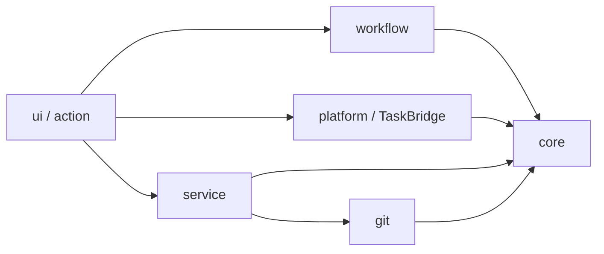
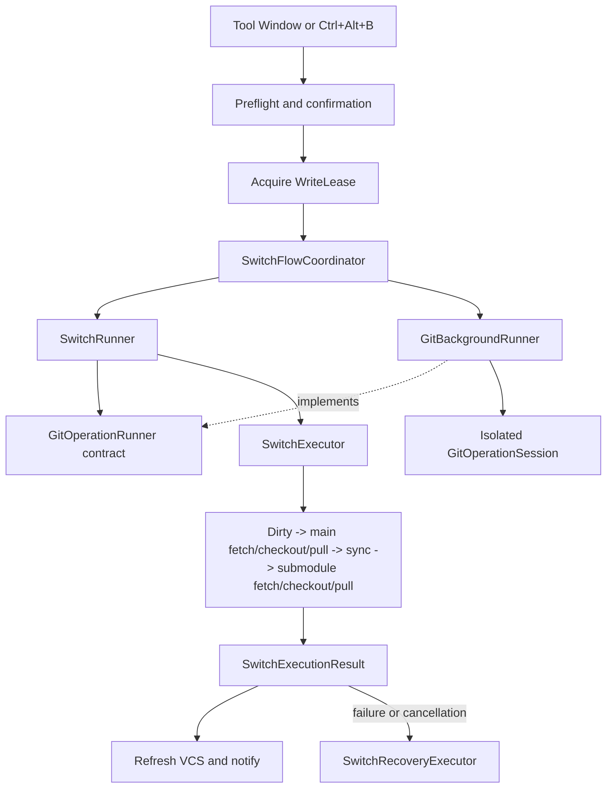

# Architecture

This document describes the current code structure of Submodule Branch
Switcher. It is the source of truth for module ownership and dependency
direction. Historical refactoring decisions remain in
[`review-history.md`](review-history.md).

## System Shape

The project has two Gradle modules:

- `core/` is pure Kotlin/JVM. It contains domain models, JSON persistence,
  narrow Git and operation interfaces, switch and recovery logic, validation,
  and pure presentation decisions. It must not import IntelliJ Platform or
  desktop UI APIs.
- `src/` is the IntelliJ Platform plugin. It contains UI, project services,
  background-task adapters, CLI Git implementation, notifications, and IDE
  integration.



The enforced rule is one-way dependency flow. `core` knows nothing about the
IDE. `workflow` imports neither IntelliJ nor `platform`, `service`, or `ui`;
the UI layer injects platform adapters through core contracts. `platform` and
`service` do not depend back on workflow or UI. `quickCheck` verifies these
package boundaries; the
[contributor validation guide](../CONTRIBUTING.md#validation) defines when to
run broader checks.

## Package Ownership

| Area | Responsibility | Main entry points |
| --- | --- | --- |
| `core/model` | Presets, resolved requests, switch options | `PresetConfig.kt` |
| `core/switch` | Preflight, ordered switch steps, checkpoints, recovery, derive | `SwitchExecutor.kt`, `SwitchRecoveryExecutor.kt` |
| `core/git` | Capability-oriented Git interfaces and results | `GitClient.kt` |
| `core/operation` | Platform-independent background Git result and progress contracts | `GitOperationRunner.kt` |
| `core/presentation` | Pure import, preset editing, shortcut, preview, and layout decisions | `PresetEditRules.kt`, `SwitchPreviewRules.kt` |
| `service` | Project-scoped state, preset repository, write lease | `BranchSwitcherService.kt`, `PresetRepository.kt` |
| `workflow` | Reusable application use cases independent of screens and IntelliJ APIs | `SwitchRunner.kt`, `DeriveBranchRunner.kt`, `SingleRepositorySwitcher.kt` |
| `platform` | IntelliJ progress/cancellation/background adapters | `GitBackgroundRunner.kt`, `SwitchAdapters.kt` |
| `git` | CLI command construction, inspection, and process lifecycle | `GitOps.kt`, `GitCommandClient.kt`, `GitProcessRunner.kt`, `GitOutputDrainer.kt` |
| `ui` | Tool Window, editors, dialogs, notifications, and screen commands | `BranchSwitcherPanel.kt`, `PresetEditor.kt`, `SwitchFlowCoordinator.kt` |
| `action` | IDE actions such as `Ctrl+Alt+B` | `SwitchPresetAction.kt` |

## Code Reading Guide

Read from stable domain rules toward IntelliJ adapters rather than starting
with the largest Swing class:

1. `PresetConfig.kt` for presets, options, and resolved requests.
2. `SwitchStep.kt` for step results, immutable state, and execution context.
3. `SwitchExecutor.kt` for the ordered pipeline.
4. `SwitchRecoveryExecutor.kt` for checkpoint and stash recovery.
5. `GitOperationRunner.kt`, `SwitchRunner.kt`, and `GitBackgroundRunner.kt` for
   the pure operation contract, workflow, and IntelliJ adapter.
6. `SwitchFlowCoordinator.kt`, `SwitchPreflightUi.kt`, and
   `SwitchResultPresenter.kt` for UI-side orchestration.

Use these paths when tracing a specific task:

```text
Preset switch:
  SwitchController -> SwitchFlowCoordinator -> SwitchRunner -> GitOperationRunner -> SwitchExecutor

Derived branch:
  SwitchController -> DeriveBranchRunner -> DeriveBranchExecutor

Preset editing:
  PresetListManager -> PresetEditor -> SubmoduleRowManager

Git command:
  GitOps -> GitCommandClient -> GitProcessRunner -> GitOutputDrainer
```

## Preset Persistence

Preset lookup order is:

1. `<project>/.idea/branch-presets.json`
2. `<project>/.branch-presets.json`
3. A parent `.branch-presets.json`, stopping at a Git repository boundary

The upward lookup has no arbitrary depth limit; the repository boundary is the
limit. `PresetLoader` owns JSON parsing, validation, in-memory ID normalization,
and atomic writes. Loading never creates or rewrites a file. The first explicit
save creates the preferred file and persists any normalized IDs.

`PresetRepository` caches the selected file for the project service, serializes
load and save operations with one mutex, and dispatches filesystem access to the
I/O dispatcher. UI state changes only after a successful repository operation.
Presets are project files, not global plugin state. Deleting an untracked
`.idea` directory also deletes presets stored there.

Global switch settings and recent history are stored through
`PersistentStateComponent` in `branch-switcher.xml`.

## Switch Flow

Both the Tool Window and keyboard action converge on the same execution path:



`SwitchExecutor` records a checkpoint before mutation and passes an immutable
`SwitchState` between steps. Stateful steps preserve the latest state even when
an exception or cancellation occurs, so recovery still knows which stashes and
checkouts completed and which missing submodules were initialized by the switch.

`SwitchRecoveryExecutor` independently attempts repository rollback and stash
restoration. It compares both branch and commit SHA, restores detached HEAD
state, and refuses a destructive hard reset when the working tree is dirty.
Submodules initialized by the failed or cancelled switch are deliberately
retained: they had no pre-switch checkpoint, and deleting a newly populated
worktree could discard useful data. Recovery logs and notifications list those
retained paths.

`SwitchPreflightUi` owns modal probing and confirmation dialogs.
`SwitchFlowCoordinator` owns write leases, switch and rollback execution, and
post-execution VCS refresh. `SwitchResultPresenter` maps structured outcomes to
history and notifications. An idempotent UI completion guard resets Tool Window
state after normal presentation and also when refresh or presentation fails.

## Derive Flow

Deriving a branch uses the same platform lifecycle boundary as switching:

```text
SwitchController
  -> DeriveBranchRunner
  -> GitBackgroundRunner
  -> DeriveBranchExecutor
```

`DeriveBranchExecutor` has three explicit phases: preflight every target,
checkpoint every accepted target, then create branches. The first two phases are
atomic gates, so no branch is created when any repository is unsafe or cannot be
checkpointed. `DeriveBranchRunner` owns task cancellation and retries rollback
in a fresh Git session after the cancelled session closes. The controller owns
only the project write lease, VCS refresh, and notification presentation.

## Preset UI Responsibilities

`PresetListManager` renders the collection and exposes stable commands to the
Tool Window. Its collaborators divide those commands by side effect:

- `PresetCollectionActions` owns load, save, add, delete, and persistence error
  reporting.
- `PresetTransferActions` owns clipboard import and export.
- `CurrentStatePresetCreator` probes checked-out branches and creates a complete
  preset from that snapshot.
- `PresetEditor` renders and edits one preset; pure `PresetEditRules` build and
  compare drafts, while `SubmoduleRowManager` owns dynamic submodule rows.
- `ToolWindowLogPanel` owns collapsible log rendering, document trimming, and
  log presentation state.

`BranchSwitcherPanel` constructs `SwitchController` before `PresetListManager`
and passes explicit command callbacks between them. Neither collaborator relies
on lazy initialization or reaches back through the other to complete its
construction.

Import validation remains a pure rule in `core/presentation`. Swing layout
helpers stay in the plugin `ui` package. UI collaborators delegate
all writes through the collection persistence path, so save failures and screen
refresh behavior remain consistent.

## Git And Cancellation

`GitOps` implements the aggregate Git interface but delegates commands to
`GitCommandClient`. Only `GitProcessRunner` starts and waits for operating-system
processes. It admits at most four active Git processes and assigns their stdout
and stderr pipes to a dedicated eight-thread drain executor. Stdout is capped at
8 MiB and fails explicitly when exceeded; stderr retains only its final 128 KiB
for diagnostics.

Each background write enters through the pure `GitOperationRunner` contract and
opens its own `GitOperationSession`. `GitBackgroundRunner` is the IntelliJ
adapter that owns session open, cancel, close, and exception conversion;
workflow callers do not import it directly. Cancellation terminates the active
process and prevents later commands in that operation. A single atomic outcome
state combines completion and cancellation callbacks, so a completed execution
result remains available for recovery when cancellation races with task
completion.

The service write lease prevents overlapping switch, derive, rollback, and
single-repository writes. Each branch-combo discovery also opens an isolated
operation session. Hiding or removing an editor, or starting a newer load for
the same combo, cancels both its coroutine and active Git process. A per-combo
generation token prevents an older result from updating newer UI state.

Read-only branch discovery and repository-state Git commands run on the I/O
dispatcher and deliver only final snapshots to the UI thread. Repository-state
refresh batches branch, HEAD, and dirty status into one CLI process per
repository. Preflight adds one refs query and, on the first query for a
repository, one remote-name query. Its failures remain fail-closed. Switch
steps, checkpoints, and recovery deliberately keep fresh reads adjacent to
mutation rather than consuming these display-oriented snapshots.

## Change Guide

Use the narrowest owner for a change:

- Add a switch stage: create or update a `SwitchStep` in `core/switch`, then add
  focused pure tests.
- Add a Git command: extend the narrowest capability interface in
  `core/git`, implement it in `GitCommandClient`, and test command/process
  behavior.
- Add a reusable use case: place platform-independent orchestration in
  `workflow`; inject operation adapters and keep dialogs and notifications in
  `ui`.
- Change preset JSON: update DTO/domain conversion and migration in `core`,
  then verify old and new files.
- Change IntelliJ progress or cancellation: keep it in `platform` or
  `TaskBridge`.
- Add a UI decision with several states: extract the decision to a pure rule
  when practical, leaving Swing rendering in `ui`.

Avoid introducing a shared abstraction only to reduce line count. The current
boundaries are intended to isolate side effects and safety decisions, not to
eliminate every small duplication.
