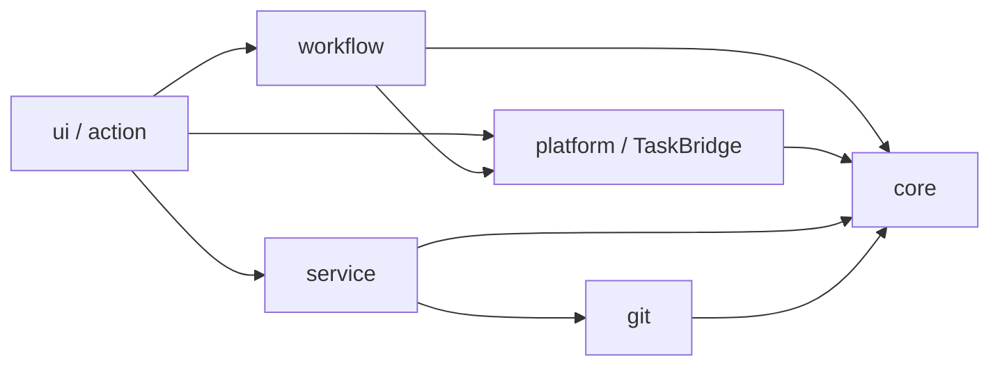
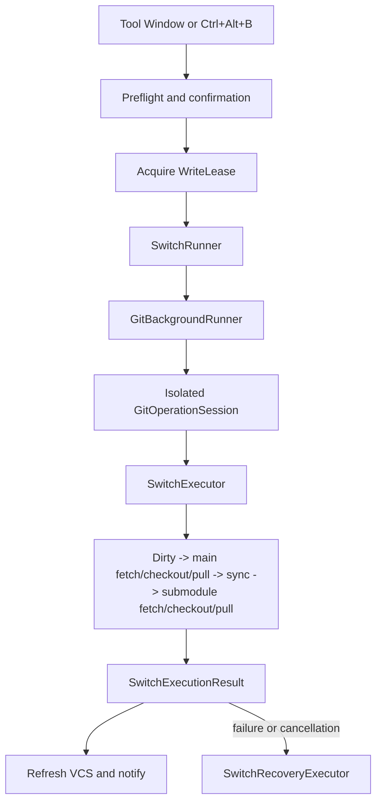

# Architecture

This document describes the current code structure of Submodule Branch
Switcher. It is the source of truth for module ownership and dependency
direction. Historical refactoring decisions remain in
[`review-history.md`](review-history.md).

## System Shape

The project has two Gradle modules:

- `core/` is pure Kotlin/JVM. It contains domain models, JSON persistence,
  narrow Git interfaces, switch and recovery logic, validation, and pure
  presentation decisions. It must not import IntelliJ Platform or desktop UI
  APIs.
- `src/` is the IntelliJ Platform plugin. It contains UI, project services,
  background-task adapters, CLI Git implementation, notifications, and IDE
  integration.



The enforced rule is one-way dependency flow. `core` knows nothing about the
IDE. `workflow`, `platform`, and `service` do not depend back on UI.
`quickCheck` verifies the important package boundaries; the
[contributor validation guide](../CONTRIBUTING.md#validation) defines when to
run broader checks.

## Package Ownership

| Area | Responsibility | Main entry points |
| --- | --- | --- |
| `core/model` | Presets, resolved requests, switch options | `PresetConfig.kt` |
| `core/switch` | Preflight, ordered switch steps, checkpoints, recovery, derive | `SwitchExecutor.kt`, `SwitchRecoveryExecutor.kt` |
| `core/git` | Capability-oriented Git interfaces and results | `GitClient.kt` |
| `core/presentation` | Pure import, shortcut, preview, and responsive-layout decisions | `PresetImportResult.kt`, `SwitchPreviewRules.kt` |
| `service` | Project-scoped state, preset repository, write lease | `BranchSwitcherService.kt`, `PresetRepository.kt` |
| `workflow` | Reusable application use cases independent of a particular screen | `SwitchRunner.kt`, `DeriveBranchRunner.kt`, `SingleRepositorySwitcher.kt` |
| `platform` | IntelliJ progress/cancellation/background adapters | `GitBackgroundRunner.kt`, `SwitchAdapters.kt` |
| `git` | CLI command construction and process lifecycle | `GitOps.kt`, `GitCommandClient.kt`, `GitProcessRunner.kt` |
| `ui` | Tool Window, editors, dialogs, notifications, and screen commands | `BranchSwitcherPanel.kt`, `PresetEditor.kt`, `SwitchFlowCoordinator.kt` |
| `action` | IDE actions such as `Ctrl+Alt+B` | `SwitchPresetAction.kt` |

## Code Reading Guide

Read from stable domain rules toward IntelliJ adapters rather than starting
with the largest Swing class:

1. `PresetConfig.kt` for presets, options, and resolved requests.
2. `SwitchStep.kt` for step results, immutable state, and execution context.
3. `SwitchExecutor.kt` for the ordered pipeline.
4. `SwitchRecoveryExecutor.kt` for checkpoint and stash recovery.
5. `SwitchRunner.kt` and `GitBackgroundRunner.kt` for task and cancellation
   lifecycle.
6. `SwitchFlowCoordinator.kt` and the UI entry point relevant to the change.

Use these paths when tracing a specific task:

```text
Preset switch:
  SwitchController -> SwitchFlowCoordinator -> SwitchRunner -> SwitchExecutor

Derived branch:
  SwitchController -> DeriveBranchRunner -> DeriveBranchExecutor

Preset editing:
  PresetListManager -> PresetEditor -> SubmoduleRowManager

Git command:
  GitOps -> GitCommandClient -> GitProcessRunner
```

## Preset Persistence

Preset lookup order is:

1. `<project>/.idea/branch-presets.json`
2. `<project>/.branch-presets.json`
3. A parent `.branch-presets.json`, stopping at a Git repository boundary

`PresetLoader` owns JSON parsing, validation, ID migration, and atomic writes.
`PresetRepository` caches the loaded file for the project service. Presets are
project files, not global plugin state. Deleting an untracked `.idea` directory
also deletes presets stored there.

Global switch settings and recent history are stored through
`PersistentStateComponent` in `branch-switcher.xml`.

## Switch Flow

Both the Tool Window and keyboard action converge on the same execution path:



`SwitchExecutor` records a checkpoint before mutation and passes an immutable
`SwitchState` between steps. Stateful steps preserve the latest state even when
an exception or cancellation occurs, so recovery still knows which stashes and
checkouts completed.

`SwitchRecoveryExecutor` independently attempts repository rollback and stash
restoration. It compares both branch and commit SHA, restores detached HEAD
state, and refuses a destructive hard reset when the working tree is dirty.

## Derive Flow

Deriving a branch uses the same platform lifecycle boundary as switching:

```text
SwitchController
  -> DeriveBranchRunner
  -> GitBackgroundRunner
  -> DeriveBranchExecutor
```

`DeriveBranchExecutor` has three explicit phases: preflight every target,
checkpoint every accepted target, then create branches. The first two phases are
atomic gates, so no branch is created when any repository is unsafe or cannot be
checkpointed. `DeriveBranchRunner` owns task cancellation and retries rollback
in a fresh Git session after the cancelled session closes. The controller owns
only the project write lease, VCS refresh, and notification presentation.

## Preset UI Responsibilities

`PresetListManager` renders the collection and exposes stable commands to the
Tool Window. Its collaborators divide those commands by side effect:

- `PresetCollectionActions` owns load, save, add, delete, and persistence error
  reporting.
- `PresetTransferActions` owns clipboard import and export.
- `CurrentStatePresetCreator` probes checked-out branches and creates a complete
  preset from that snapshot.
- `PresetEditor` renders and edits one preset; `SubmoduleRowManager` owns its
  dynamic submodule rows.
- `ToolWindowLogPanel` owns collapsible log rendering, document trimming, and
  log presentation state.

`BranchSwitcherPanel` constructs `SwitchController` before `PresetListManager`
and passes explicit command callbacks between them. Neither collaborator relies
on lazy initialization or reaches back through the other to complete its
construction.

Import validation remains a pure rule in `core/presentation`. Swing layout
helpers stay in the plugin `ui` package. UI collaborators delegate
all writes through the collection persistence path, so save failures and screen
refresh behavior remain consistent.

## Git And Cancellation

`GitOps` implements the aggregate Git interface but delegates commands to
`GitCommandClient`. Only `GitProcessRunner` starts and waits for operating-system
processes.

Each background write opens its own `GitOperationSession`. Cancellation affects
that session, terminates its running process, and prevents later commands in the
same operation from starting. `GitBackgroundRunner` owns session open, cancel,
close, and exception conversion; callers must not duplicate that lifecycle.

The service write lease prevents overlapping switch, derive, rollback, and
single-repository writes. Read-only detection may continue independently.

## Change Guide

Use the narrowest owner for a change:

- Add a switch stage: create or update a `SwitchStep` in `core/switch`, then add
  focused pure tests.
- Add a Git command: extend the narrowest capability interface in
  `core/git`, implement it in `GitCommandClient`, and test command/process
  behavior.
- Add a reusable use case: place orchestration in `workflow`; keep dialogs and
  notifications in `ui`.
- Change preset JSON: update DTO/domain conversion and migration in `core`,
  then verify old and new files.
- Change IntelliJ progress or cancellation: keep it in `platform` or
  `TaskBridge`.
- Add a UI decision with several states: extract the decision to a pure rule
  when practical, leaving Swing rendering in `ui`.

Avoid introducing a shared abstraction only to reduce line count. The current
boundaries are intended to isolate side effects and safety decisions, not to
eliminate every small duplication.
