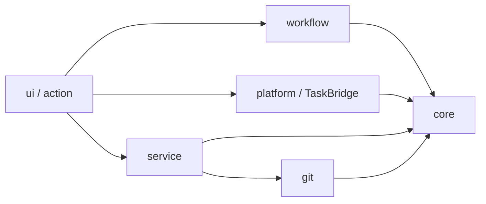
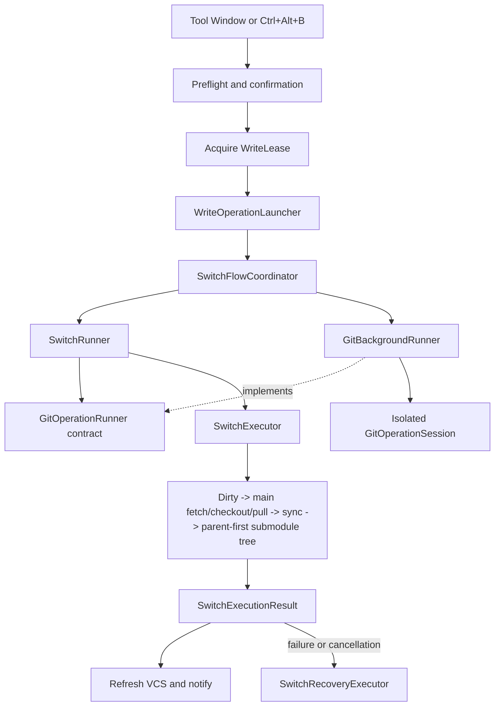

# Architecture

This document describes the current code structure of Submodule Branch
Switcher. It is the source of truth for module ownership and dependency
direction. Historical refactoring decisions remain in
[`review-history.md`](review-history.md).

## System Shape

The project has two Gradle modules:

- `core/` is pure Kotlin/JVM. It contains domain models, JSON persistence,
  narrow Git and operation interfaces, switch and recovery logic, validation,
  and pure presentation decisions. It must not import IntelliJ Platform or
  desktop UI APIs.
- `src/` is the IntelliJ Platform plugin. It contains UI, project services,
  background-task adapters, CLI Git implementation, notifications, and IDE
  integration.



The enforced rule is one-way dependency flow. `core` knows nothing about the
IDE. `workflow` imports neither IntelliJ nor `platform`, `service`, or `ui`;
the UI layer injects platform adapters through core contracts. `platform` and
`service` do not depend back on workflow or UI. `quickCheck` verifies these
package boundaries; the
[contributor validation guide](../CONTRIBUTING.md#validation) defines when to
run broader checks.

Concurrent repository-state probes are throttled below the Git process-pool
bound so one slot stays free for a foreground switch or recovery. The UI layer
injects that bound (`MAX_CONCURRENT_GIT_PROCESSES`) into
`RepositoryStateRefreshCoordinator`; `workflow` never imports the plugin `git`
package. `quickCheck` permits `workflow` to import `git`, but the binding rule
is that `workflow` must still reference neither IntelliJ APIs nor concrete
command implementations (`GitOps`, `GitCommandClient`, `GitProcessRunner`).

The product models one main Git repository and the recursive submodule graph
registered through `.gitmodules`. Multiple independent VCS roots and arbitrary
sibling repositories are outside this architecture; supporting them would
require a different preset, checkpoint, and recovery model.

## Package Ownership

| Area | Responsibility | Main entry points |
| --- | --- | --- |
| `core` root | Preset JSON lookup, parsing, and atomic persistence | `PresetLoader.kt` |
| `core/model` | Presets, resolved requests, switch options | `PresetConfig.kt` |
| `core/switch` | Preflight, ordered steps, immutable state, lock guard, structured issues, recovery plans, derive | `SwitchExecutor.kt`, `SwitchStep.kt`, `SwitchRecoveryExecutor.kt`, `DeriveBranchExecutor.kt`, `WriteGuardGitClient.kt` |
| `core/git` | Capability-oriented Git interfaces and results | `GitClient.kt` |
| `core/operation` | Platform-independent background Git result and progress contracts | `GitOperationRunner.kt` |
| `core/presentation` | Pure import, preset editing, shortcut, and preview decisions | `PresetEditRules.kt`, `SwitchPreviewRules.kt` |
| `core/settings` | Pure settings normalization and descriptions | `SettingsRules.kt` |
| `core/log` | Platform-independent logging contracts and diagnostic sanitization | `AppLogger.kt`, `DiagnosticSanitizer.kt`, `DiagnosticFingerprint.kt` |
| `service` | Project-scoped state, preset repository, write lease | `BranchSwitcherService.kt`, `PresetRepository.kt` |
| `workflow` | Reusable use cases and cancellable read coordination independent of IntelliJ APIs | `SwitchRunner.kt`, `RepositoryStateRefreshCoordinator.kt` |
| `platform` | IntelliJ progress/cancellation/background adapters | `GitBackgroundRunner.kt`, `SwitchAdapters.kt` |
| `git` | CLI command construction, inspection, and process lifecycle | `GitOps.kt`, `GitCommandClient.kt`, `GitProcessRunner.kt`, `GitOutputDrainer.kt` |
| `ui` | Tool Window, editors, dialogs, notifications, and screen commands | `BranchSwitcherPanel.kt`, `PresetEditor.kt`, `SwitchFlowCoordinator.kt` |
| `action` | IDE actions such as `Ctrl+Alt+B` | `SwitchPresetAction.kt` |
| `settings` | IntelliJ settings form and service binding | `BranchSwitcherConfigurable.kt` |

## Code Reading Guide

Read from stable domain rules toward IntelliJ adapters rather than starting
with the largest Swing class:

1. `PresetConfig.kt` for presets, options, and resolved requests.
2. `SwitchStep.kt` for step results, immutable state, and execution context.
3. `SwitchExecutor.kt` for the ordered pipeline, and `WriteGuardGitClient.kt`
   for the pre-write lock guard.
4. `SwitchRecoveryExecutor.kt` for checkpoint and stash recovery.
5. `GitOperationRunner.kt`, `SwitchRunner.kt`, and `GitBackgroundRunner.kt` for
   the pure operation contract, workflow, and IntelliJ adapter.
6. `SwitchFlowCoordinator.kt`, `SwitchPreflightUi.kt`, and
   `SwitchResultPresenter.kt` for UI-side orchestration.

Use these paths when tracing a specific task:

```text
Preset switch:
  SwitchController -> SwitchFlowCoordinator -> SwitchRunner -> GitOperationRunner -> SwitchExecutor

Derived branch:
  SwitchController -> DeriveBranchRunner -> DeriveBranchExecutor

Preset editing:
  PresetListManager -> PresetEditor -> SubmoduleRowManager

Git command:
  GitOps -> GitCommandClient -> GitProcessRunner -> GitOutputDrainer
```

## Preset Persistence

Preset lookup order is:

1. `<project>/.idea/branch-presets.json`
2. `<project>/.branch-presets.json`
3. A parent `.branch-presets.json`, stopping at a Git repository boundary

The upward lookup has no arbitrary depth limit; the repository boundary is the
limit. The first match wins, so `.idea/branch-presets.json` is a personal
override when a shared root file also exists. **Open Preset File** reveals the
active path. When no file exists, the first successful save creates the
personal `.idea` file; teams opt into sharing by creating and committing the
root file. `PresetLoader` owns JSON parsing, validation, in-memory ID normalization,
and atomic writes. Loading never creates or rewrites a file. The first explicit
save creates the preferred file and persists any normalized IDs.

`PresetRepository` caches the selected file for the project service, serializes
load and save operations with one mutex, and dispatches filesystem access to the
I/O dispatcher. UI state changes only after a successful repository operation.
Presets are project files, not global plugin state. Deleting an untracked
`.idea` directory also deletes presets stored there.

Loads record a SHA-256 digest of the exact bytes that were parsed
(`PresetLoader.loadWithDigest`), so the recorded digest can never describe
different content than the in-memory presets. Saves are optimistic conflict
checks: the file is re-read and its digest compared against the load-time digest;
a mismatch means the file changed outside the IDE since loading, so the save is
refused with `PresetFileChangedException` and the UI offers a reload action
instead of silently overwriting. The saver returns the digest of the bytes it
wrote, so no post-write re-read is needed and memory and disk stay consistent.
The check-and-write window is intentionally optimistic (microseconds); full
protection would require file locking, which is disproportionate for a
project-local JSON file.

Global switch settings and recent history are stored through
`PersistentStateComponent` in `branch-switcher.xml`.

## Switch Flow

Both the Tool Window and keyboard action converge on the same execution path:



One `OperationContext` is created before preflight and reused for execute,
refresh, and recovery phases. Log prefixes therefore keep one operation ID,
such as `switch-a1b2c3d4/preflight` and `switch-a1b2c3d4/execute`, across the
whole user action.

`SwitchExecutor` records a checkpoint before mutation and passes an immutable
`SwitchState` between steps. Stateful steps preserve the latest state even when
an exception or cancellation occurs, so recovery still knows which stashes and
checkouts completed and which missing submodules were initialized by the switch.
Tracked stashes store their immutable Git object IDs rather than stack positions;
recovery applies that object ID directly and retains the Git stash entry as a
manual recovery backup. It never maps the ID back to a mutable `stash@{n}` or
automatically drops an entry across a race window.
Each stash is marked before apply because a failed or interrupted apply may
already have changed the worktree. Later automatic stages do not replay it,
and the notification rollback action expires when started. The retained stash
object remains available for manual inspection and recovery. If identity cannot be read
after stash creation, the repository is blocked
and the unresolved stash remains in structured recovery state for manual review.
After the main repository is current, `SubmoduleTreeStep` processes submodules
in parent-first order. Each parent is prepared, fetched, checked out, pulled,
and synchronized before descendants are inspected, so nested `.gitmodules`
changes are visible in the same operation. A moved path can be initialized
normally, while a stale preset path is skipped and its obsolete local worktree
is retained. Nested initialization runs from the immediate parent repository,
not from the project root.

`SubmoduleTopology.isUnregistered` is the shared write gate for preset switching,
single-repository switching, and derive operations. A retained worktree whose
path is absent from the current `.gitmodules` graph remains on disk but cannot
be modified through those workflows. Recovery deliberately does not use current
registration because rolling the main repository back may legitimately make a
checkpointed path obsolete.

A second gate closes the check-then-act window between preflight and mutation:
`WriteGuardGitClient` wraps the injected `SwitchGitClient` and rechecks
`index.lock` immediately before every write operation, aborting with a
structured `IndexLockBlockedException` when a lock has appeared. `IndexLockBlock`
and `LockBlockedPresentation` keep blocked-repository paths as locale-neutral
structured data so the UI can present and localize the message without parsing
English diagnostics. Core also recognizes cancellation without knowing IDE
types: `CancellationClassifier` maps an exception to cancellation (defaulting to
JDK `CancellationException`), while `CancellationHandle` and `ProgressHandle`
expose platform-neutral cancellation and progress checkpoints that `platform`
adapts to an IntelliJ `ProgressIndicator`.

`SwitchRecoveryExecutor` first builds an immutable `SwitchRecoveryPlan` listing
repository targets, stash actions, and retained initialized worktrees. The plan
is inspectable before execution. Repository actions are idempotent and report a
structured per-path outcome. Every mutation rechecks repository existence and
identity; destructive reset additionally requires a clean worktree, while plain
checkout lets Git reject conflicts so restored user changes can travel back to
their original branch. Successful commands must satisfy the checkpoint HEAD
postcondition. Repository rollback and stash restoration remain
independent, so one failure does not prevent the other.
Stash apply is at-most-once for each tracked switch state: the state is marked
before invoking Git because a failed or interrupted apply may already have
changed the worktree. Later automatic stages do not replay that stash, and the
notification rollback action expires when started. The retained stash object
remains available for manual inspection or recovery.
Checkpoints also retain the canonical Git directory identity. Recovery and
derive rollback skip a path if a different repository later occupies it.
Before ordinary writes, an initialized submodule must report a superproject
inside the project and external Git metadata rather than a standalone `.git`
directory in the worktree. Structured `.gitmodules` registrations also retain
the section name and immediate parent. The expected `.git/modules/<section>`
directory must match the worktree identity, which rejects swapped paths. The
checkpointed `.gitmodules`-declared URL must still match after `submodule sync`,
which rejects repository replacement at an unchanged path.
Submodules initialized by the failed or cancelled switch are deliberately
retained: they had no pre-switch checkpoint, and deleting a newly populated
worktree could discard useful data. Recovery logs and notifications list those
retained paths.

Recoverable switch and derive failures use `OperationIssue` stage/code/path
values. Human-readable Git details remain optional diagnostics rather than the
authoritative control-flow result.

`SwitchPreflightUi` owns modal probing and confirmation dialogs.

## Thread Contract

Workflow code never executes blocking work on the IntelliJ event dispatch
thread. `SwitchRunner`, `DeriveBranchRunner`, and single-repository writes enter
an I/O dispatcher before opening a Git operation and retain that worker context
through result interpretation and recovery. IntelliJ background-task callbacks
may complete on the EDT, but coroutine continuations resume through their
dispatcher rather than inheriting the callback thread.

UI rendering, dialogs, and notifications are scheduled explicitly through the
UI adapters. Repository inspection, CLI Git, VFS refresh, checkpoint recovery,
and stash restoration remain worker-thread operations. New workflow entry
points must establish their worker context internally instead of relying only
on callers to launch them from a particular dispatcher.
`WriteOperationLauncher` owns the lease boundary for every repository mutation.
It releases the lease before its `afterRelease` stage runs VCS refresh or UI
presentation. `SwitchResultPresenter` maps structured outcomes to
history and notifications. An idempotent UI completion guard resets Tool Window
state after normal presentation and also when refresh or presentation fails.

## Derive Flow

Deriving a branch uses the same platform lifecycle boundary as switching:

```text
SwitchController
  -> DeriveBranchRunner
  -> GitBackgroundRunner
  -> DeriveBranchExecutor
```

`DeriveBranchExecutor` has three explicit phases: preflight every target,
checkpoint every accepted target, then create branches. The first two phases are
atomic gates, so no branch is created when any repository is unsafe or cannot be
checkpointed. `DeriveBranchRunner` owns task cancellation and retries rollback
in a fresh Git session after the cancelled session closes. Rollback reports
the repository paths that remain pending, so an interrupted rollback retries
only those paths instead of skipping cleanup or repeating branch deletion for
repositories already restored. The controller owns only the
project write lease, VCS refresh, and notification presentation.

## Preset UI Responsibilities

`PresetListManager` renders the collection and exposes stable commands to the
Tool Window. Its collaborators divide those commands by side effect:

- `PresetCollectionActions` owns load, save, add, delete, and persistence error
  reporting.
- `PresetTransferActions` owns clipboard import and export.
- `CurrentStatePresetCreator` probes checked-out branches and creates a complete
  preset from that snapshot.
- `PresetEditor` renders and edits one preset; pure `PresetEditRules` build and
  compare drafts, while `SubmoduleRowManager` owns dynamic submodule rows.
- `ToolWindowLogPanel` owns bounded log rendering, timestamps, latest-operation
  filtering/copying, clearing, and access to the complete `idea.log`.

`BranchSwitcherPanel` constructs `SwitchController` before `PresetListManager`
and passes explicit command callbacks between them. Neither collaborator relies
on lazy initialization or reaches back through the other to complete its
construction.

Repository-state subscriptions and the Swing debounce remain in
`BranchSwitcherPanel`, while `RepositoryStateRefreshCoordinator` owns each
cancellable read session. Starting a newer refresh cancels the older coroutine
and Git process; generation checks at final UI delivery prevent stale snapshots
from updating preset editors. Closing the panel cancels the active session.

Import validation remains a pure rule in `core/presentation`. Swing layout
helpers stay in the plugin `ui` package. `ViewportWidthPanel` makes scroll
content adopt the visible Tool Window width, `ResponsiveRowPanel` stacks two
regions only when their rendered content no longer fits,
`TrailingControlRowPanel` reserves the trailing icon action before eliding long
leading text, and `CollapsibleActionBar` retains primary and overflow actions while moving a
secondary action into the existing overflow menu. Main and submodule branch
selectors share one responsive form-row builder. These components measure
actual Swing preferred sizes: command buttons keep their native compact width,
while branch fields use the remaining space up to a bounded maximum. Form rows
and preset headers therefore adapt to localized text and Look-and-Feel metrics;
the only explicit width transition is the approved 340 px compact mode that
turns Add Preset into an icon and moves Derive into overflow. Preset identity
and actions share one row when they fit and stack without stretching at compact
widths. Hidden regions reserve neither a gap nor a second line, and inset or
stacked-indent offsets are clamped when the assigned width is smaller than the
normal padding. Before a row receives its next rendered width, provisional
sizing keeps the last rendered stacked height and may conservatively stack from
the narrowest laid-out ancestor. Only `doLayout()` may change the row mode from
its assigned width; a mode change schedules one ancestor revalidation so `BoxLayout` cannot
retain a stale one-line height. Overflow allocation preserves the more button
before shrinking primary actions. The editor footer uses a nested responsive
row, so Add Submodule stacks first and Discard/Save stack again at extreme
widths instead of relying on implicit `FlowLayout` wrapping. All three footer
actions share one left baseline while stacked; the outer row still places the
save group on the right when horizontal space is available. Responsive rows
report a zero content minimum width because their custom layout already clips
or stacks every child within the assigned viewport; minimum height follows the
current horizontal or stacked mode. This prevents `BoxLayout` from allocating
an off-screen natural width. The current preset omits the
redundant unavailable switch action. Overflow actions use one shared Swing menu
that retains IntelliJ Look-and-Feel behavior while bounding the design width,
grouping, icon spacing, destructive tone, and right-edge anchoring. The approved
interactive layout reference is stored in
[`design/branch-switcher-ui-v1.html`](design/branch-switcher-ui-v1.html).

UI collaborators delegate all writes through the collection persistence path,
so save failures and screen refresh behavior remain consistent.

## Git And Cancellation

`GitOps` implements the aggregate Git interface but delegates commands to
`GitCommandClient`. Only `GitProcessRunner` starts and waits for operating-system
processes; the sole exception is `GitOps.isGitOnPath()`, which probes
`git --version` directly — a deliberate allowance enforced by `quickCheck`. It admits at most four active Git processes and assigns their stdout
and stderr pipes to a dedicated eight-thread drain executor. Stdout is capped at
8 MiB and fails explicitly when exceeded; stderr retains only its final 128 KiB
for diagnostics. Cancellation, timeout, and blocked output capture terminate
every descendant observed while the command was running and close the parent
process streams. If forced termination does not finish within its budget, that
process capacity remains reserved until the observed processes actually exit,
rather than being advertised early to later Git commands. A later command waits
at most the configured Git timeout for capacity, then returns the distinct
`PROCESS_CAPACITY` failure instead of waiting indefinitely. If the JVM cannot
provide an `onExit` future, a bounded daemon watcher polls for actual exit before
returning the reserved capacity.

`.gitmodules` values are read through `git config --null --file`, not a custom
line parser, so Git owns quoting, comments, escaping, and malformed-file
diagnostics.

Each background write enters through the pure `GitOperationRunner` contract and
opens its own `GitOperationSession`. `GitBackgroundRunner` is the IntelliJ
adapter that owns session open, cancel, close, and exception conversion;
workflow callers do not import it directly. Cancellation terminates the active
process and prevents later commands in that operation. A single atomic outcome
state combines completion and cancellation callbacks, so a completed execution
result remains available for recovery when cancellation races with task
completion.

Remote-name selection is cached per `GitOperationSession`: the shared
`GitOps.directClient` keeps a long-lived cache for direct non-session calls,
but every `openOperation()` starts with a fresh empty cache and preflight
inspection uses a fresh short-lived session, so a later switch observes remotes
renamed or replaced since the previous request.

The service write lease prevents overlapping switch, derive, rollback, and
single-repository writes. Each branch-combo discovery also opens an isolated
operation session. Hiding or removing an editor, or starting a newer load for
the same combo, cancels both its coroutine and active Git process. A per-combo
generation token prevents an older result from updating newer UI state.

Read-only branch discovery and repository-state Git commands run on the I/O
dispatcher and deliver only final snapshots to the UI thread. Each state
refresh owns an isolated operation session that is cancelled when superseded or
disposed. Repository-state
refresh batches branch, HEAD, and dirty status into one CLI process per
repository. Preflight adds one refs query and, on the first query for a
repository, one remote-name query. Its failures remain fail-closed. Switch
steps, checkpoints, and recovery deliberately keep fresh reads adjacent to
mutation rather than consuming these display-oriented snapshots.

## Diagnostic Logging

`ToolWindowLogger` mirrors every user-visible level to the IntelliJ diagnostic
logger named `SubmoduleBranchSwitcher`; the Tool Window is a bounded transient
view, while `idea.log` is the durable diagnostic source. Throwable-aware
`warn`/`error` calls retain full stack traces in `idea.log` and keep the Tool
Window message concise.

Each switch, derive, and single-repository write wraps its logger with a short
operation ID and phase. Request context, effective options, structured issue
codes, per-repository checkpoints, recovery actions, VCS refresh, and final
summaries retain that ID. The Tool Window adds timestamps and can filter or copy
the latest write operation, clear its bounded view, or reveal the complete
`idea.log`. Git diagnostics sanitize URI/SCP remotes and credential-like values;
SHA-256 placeholders still allow comparison without exposing private locations.

## Change Guide

Use the narrowest owner for a change:

- Add a switch stage: create or update a `SwitchStep` in `core/switch`, then add
  focused pure tests.
- Add a Git command: extend the narrowest capability interface in
  `core/git`, implement it in `GitCommandClient`, and test command/process
  behavior.
- Add a reusable use case: place platform-independent orchestration in
  `workflow`; inject operation adapters and keep dialogs and notifications in
  `ui`.
- Change preset JSON: update DTO/domain conversion and migration in `core`,
  then verify old and new files.
- Change IntelliJ progress or cancellation: keep it in `platform` or
  `TaskBridge`.
- Add a UI decision with several states: extract the decision to a pure rule
  when practical, leaving Swing rendering in `ui`.

Avoid introducing a shared abstraction only to reduce line count. The current
boundaries are intended to isolate side effects and safety decisions, not to
eliminate every small duplication.
